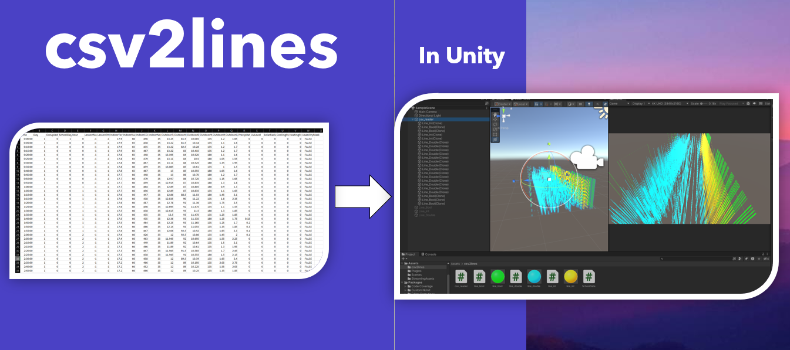

# csv2lines
Takes a CSV file (located in "StreamingAssets" folder), and renders a straight line for every column of data

See PPT for outline [here](./Slides/csv2lines.pptx)

Simplest approach: download the csv2lines [Unity Package](./csv2lines.unitypackage), and `Import` into your project.

**The Data**  
This is using publicly available data: [Indoor Sensors](https://physionet.org/content/in-gauge-and-en-gage/1.0.0/
), which captures 23 fields every 5 minutes for a span of 169 days (using `KB5.csv` for this project).
